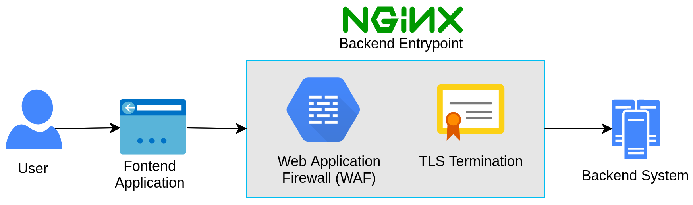

# Docker + NGINX + TLS Termination + ModSecurity Web Application Firewall 3 (WAF3)

<center>



</center>

This repository is an attempt to combine two existing repositories (listed below) which each adds some extra functionality to [*NGINX*](https://www.nginx.com/) beyond what one usually gets with an [official NGINX base Docker image](https://hub.docker.com/_/nginx). The purpose of combining these two repositores is to be able build and run a single Docker image of NGINX and thus  use NGINX as a primary entrypoint for all incoming client requests going to a backend system. In this context, the role of NGINX can thus be said to primarily that of a *Load Balancer* and a *reverse proxy server* that directs incoming requests to the appropriate backend server. NGINX is also used here to add Cross Origin Resource Sharing (CORS) headers in the responses to client requests.

The two repositories that have been combined into this one are described in the following:
1. [docker-waf](https://github.com/theonemule/docker-waf) by [theonemule](https://github.com/theonemule). This repository contains the Dockerfiles to build a custom Docker image of NGINX with the [*ModSecurity Web Application Firewall*](https://github.com/SpiderLabs/ModSecurity) extension.
2. [docker-nginx-certbot](https://github.com/staticfloat/docker-nginx-certbot/) by [staticfloat](https://github.com/staticfloat). This repository contains the Dockerfiles to build a Docker image that uses [*Let's Encrypt*](https://letsencrypt.org/) and [*Certbot*](https://certbot.eff.org/) to add TLS/SSL termination capabilities to NGINX.

Conclusively, this repository thus contains all the files needed to build and run a Docker image of NGINX with a WAF and TLS/SSL termination capabilities.

The main changes/additions are:
- All Docker images now use [Alpine Linux](https://alpinelinux.org/) as the image base (for smaller Docker images). 
- A Python templating script `GenConfFiles.py` has been added to more easily set the correct parameters and generate the correct configuration files.  


### A Small Note

To be able to combine the two repositories in the easiest way and to reduce build time, two intermediate Docker images are built:

```
waf3_dep --> waf3 --> nginx
```

The Docker images `waf3_dep` and `waf3` are simply intermediate images used by the final `nginx` Docker image that runs NGINX and Certbot. 


## Directory & File Overview

A rough overview and a description of the most important files and directories in this repository is given below: 

```text
.

├── base/
│   └── conf/       <-- This directory contains templates for automatically
│                       generating Dockerfiles and configuration files.
├── GenConfFiles.py <-- This python script automatically generates configuration files
│                        and places them in the right directories.
├── nginx/          <-- (Is automatically generated.)   
│   ├── conf.d/     <-- The main NGINX Dockerfile and configuration file is located in
│   │                    this directory. 
│   └── https/      <-- This is where the Let's Encrypt certificates are located.
├── settings.env    <-- All vital settings and file paths are set in this file.
│                       All configuration files are generated based on the content
│                       of this file. The GenConfFiles.py parses this file.
├── waf3_dep/       <-- A Dockerfile is located here. It is used to build an intermediate
│                       base image which is used to build NGINX with the ModSecurity WAF.
├── waf3/           <-- A Dockerfile is located here. It is used to build Docker image of
│                       NGINX with the ModSecurity WAF extension.
└── web/            <-- This is where the test app source code is located.
```


## Prerequisites & Usage

- Git
- Python 3 along with the pip package manager to automatically install all Python dependencies
- Docker & Docker Compose


### Deployment

- 1: Pull the repository, navigate to the root directory of the repository and install Python dependencies by running:

```bash
git pull https://github.com/NicklasXYZ/Docker-NGINX-Certbot-ModSecurity.git && \
cd Docker-NGINX-Certbot-ModSecurity/ && \
pip install -r requirements.txt
```

- 3: Read through the `settings.env` file and set the appropriate settings

- 4: Generate all the appropriate configuration files (based on the content of the `settings.env` file):

```bash
python GenConfFiles.py --env_file settings.env
```

- 2: Generate an SSL dhparam file (the filename should be the same as the one set in the `settings.env` file) with openssl:

```bash
# The path "nginx/dhparams" is hardcoded in the GenConfFiles.py file.
# It should thus not be changed. 
openssl dhparam -out nginx/dhparams/dhparam2048.pem 2048  
```

- 5: Possibly make some final edits to the generated `nginx.conf` file. This file is located in the `nginx/conf.d/` directory. 

- 6: Create and start all services/docker containers via docker compose by running (this might take a while):

```bash
sudo docker-compose up --build
```

